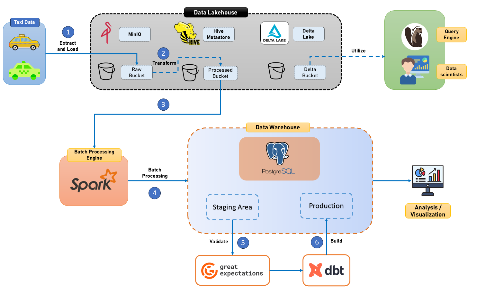
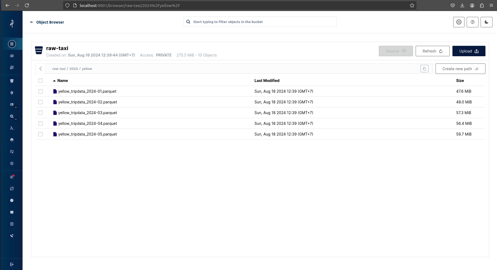
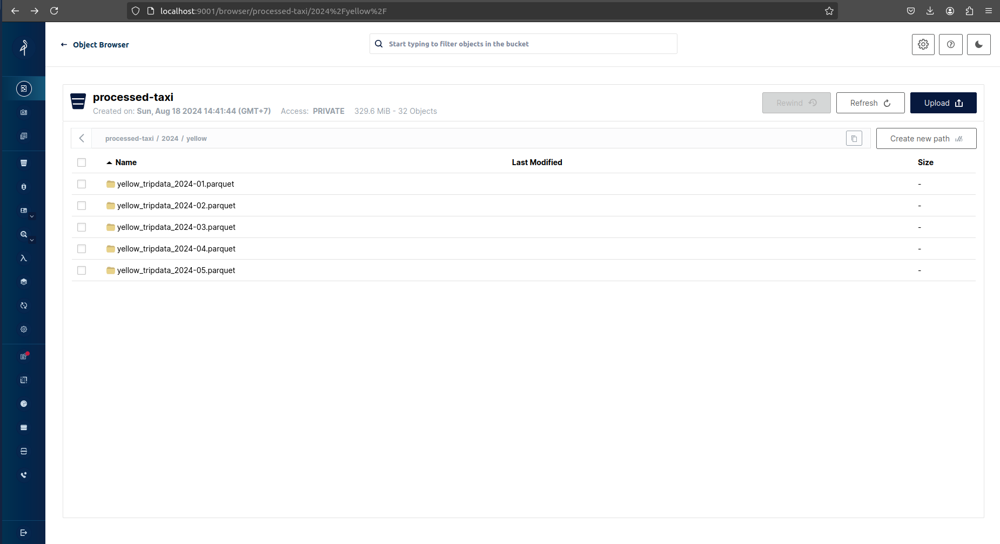
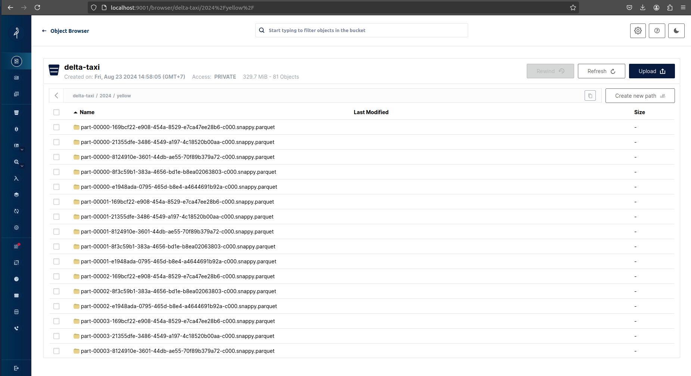
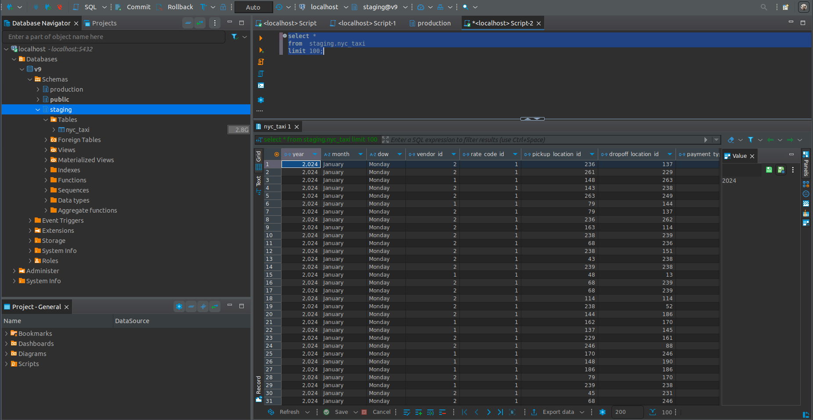
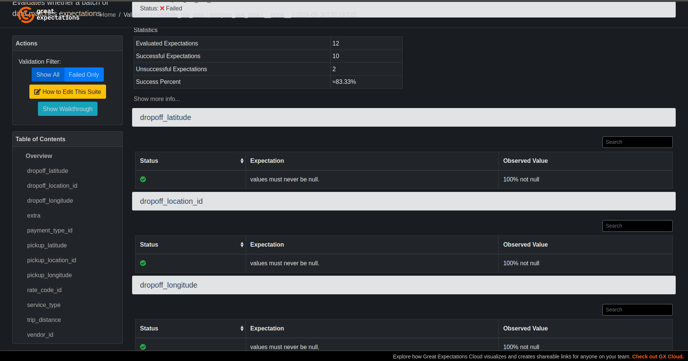
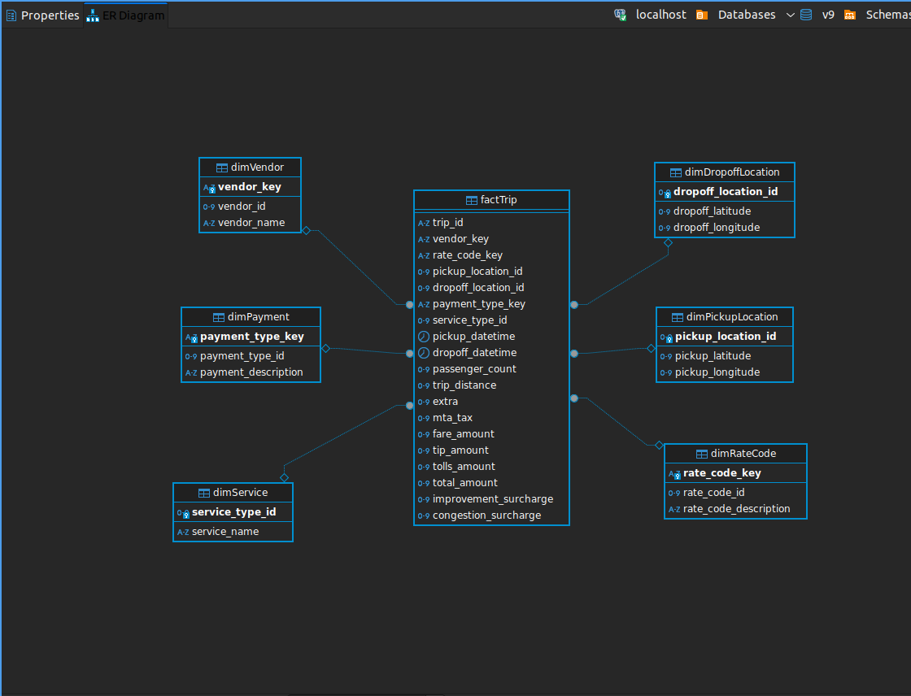

# Data Batch Processing

## Overview

* Extract and Load Raw Data to MinIO Datalake
* Transform Raw Data Using Apache Spark
* Batch Process Data to PostgreSQL Data Warehouse (Staging Area)
* Validate Data Quality Using Great Expectations
* Transform and Build Star Schema Using dbt (Data Build Tool)
* Visualize and Query the Data Using DBeaver
* Monitor and Automate the Pipeline

## Project structure

## System Architecture

<p align = "center">
    
</p>

## Prequisites 

Before runing this script, ensure you have the following installed.\
**Note**:  The project was setup on Ubuntu 22.04 OS.

* Ubuntu 22.04 (prefered, but you can use Ubuntu 20.04)
* Python 3.10
* Apache Spark (installed locally)
* Apache Airflow
* Docker
* Minio
* DBeaver CE

## Setup

1. **Clone the repository**
```bash
git clone https://github.com/VuBacktracking/data-batch-processing.git
cd data-batch-processing
```

2. **Start our data streaming infrastructure**
```bash
sudo service docker start
docker compose -f docker-compose.yaml up -d
```

3. **Setup environment**
```bash
python3 -m venv .venv
pip install -r requirements.txt
```

Create `.env` file and paste your MINIO keys, SPARK_HOME in it.
```ini
# Minio
MINIO_ACCESS_KEY=minio_access_key
MINIO_SECRET_KEY=minio_secret_key
MINIO_ENDPOINT=localhost:9000

# PostgreSQL
POSTGRES_DB=v9
POSTGRES_USER=v9
POSTGRES_PASSWORD=v9
POSTGRES_HOST=127.0.0.1
POSTGRES_PORT=5432
DB_STAGING_TABLE=staging.nyc_taxi
```

4. **Services**

* Postgres is accessible on the default port 5432.
* MinIO: http://localhost:9001.

## Batch Processing

**Note**: You schould check your data directory's structure before running. You should modify the code based on your structure. If you want to integrate data from other years, you can modify the `extract_load.py` script within the `year` variable (list years).

- **Step 1. Load the data (parquet format) from local to `raw` bucket in Datalake (MinIO)**
```bash
python3 elt_process/extract_load.py
```
<p align = "center">
    
</p>

- **Step 2. Transform data**

```bash
python3 elt_process/transform.py
```
<p align = "center">
    
</p>

- **Step 3 (Optional). Convert data into delta format**

```bash
python3 elt_process/convert-to-delta.py
```
<p align = "center">
    
</p>


- **Step 4. Create schema and table in Datawarehouse**
```bash
python3 datawarehouse_operations/create_schema.py
python3 datawarehouse_operations/create_table.py
```

- **Step 5. Start batch processing data to Data Warehouse**
```bash
python3 batch_processing/datalake2warehouse.py
```
<p align = "center">
    
</p>

## Data Validation

### Utilize Great Expectations to validate data quality

```bash
cd data_validation
```

Then, run the `data_validation.py`
```bash
python data_validation.py
```
<p align = "center">
    
</p>

## Transform the Data Warehouse using DBT
Read [README.md](dbt_taxi/README.md) for more details.
<p align = "center">
    
</p>
