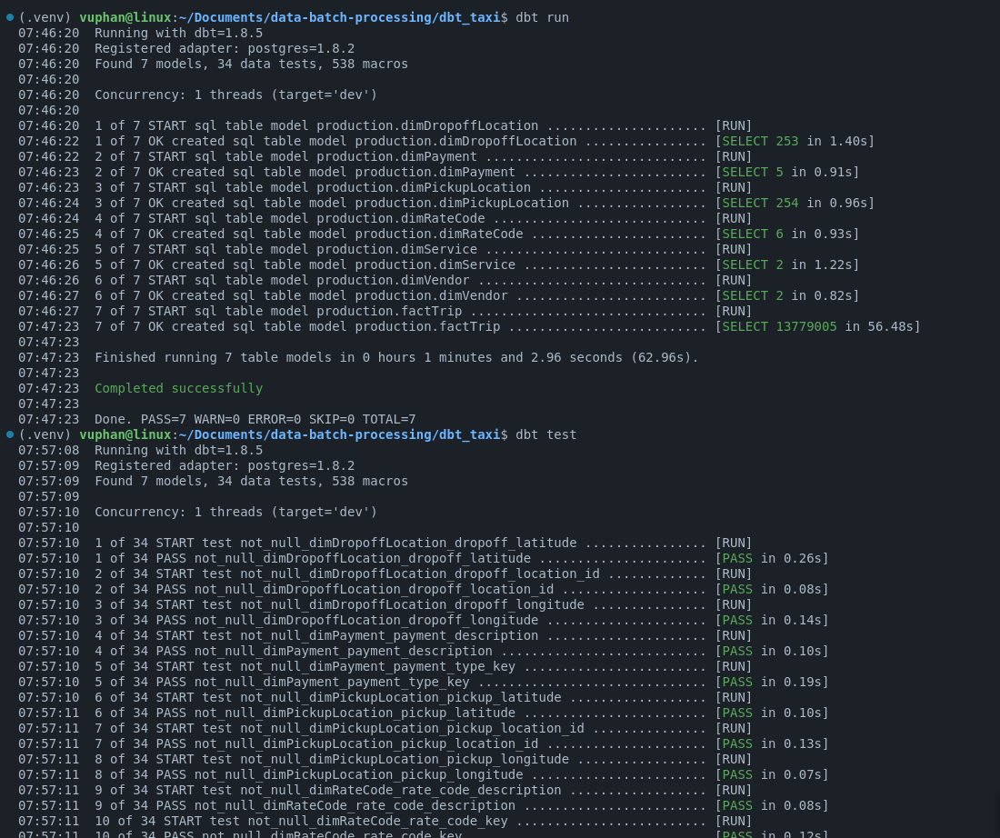

# Welcome to dbt project!
<p align = "center">
    
</p>

### Using the project

- **Step 1. Install packages**
```bash
dbt deps
```
- **Step 2. Run dbt**

Try running the following commands:
```bash
dbt run
dbt test
```

- **Step 3 (Optional). Generate document**
```bash
dbt docs generate
dbt docs serve
```

<p align = "center">
    
</p>

### Resources:
- Learn more about dbt [in the docs](https://docs.getdbt.com/docs/introduction)
- Check out [Discourse](https://discourse.getdbt.com/) for commonly asked questions and answers
- Join the [chat](https://community.getdbt.com/) on Slack for live discussions and support
- Find [dbt events](https://events.getdbt.com) near you
- Check out [the blog](https://blog.getdbt.com/) for the latest news on dbt's development and best practices
